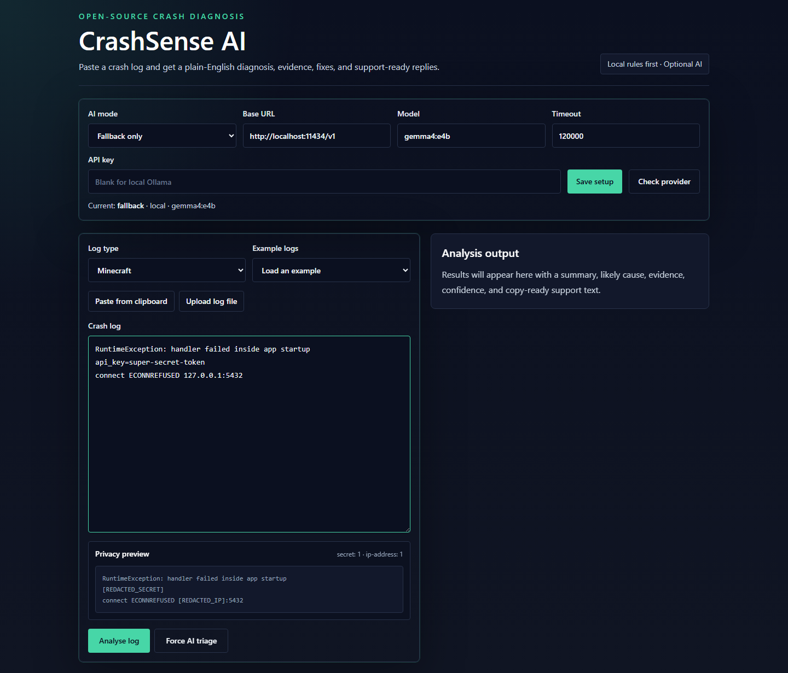
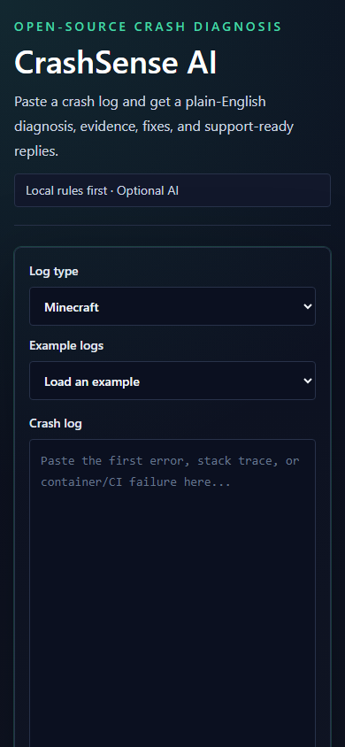

# CrashSense AI

CrashSense AI is an open-source web app that turns crash logs into plain-English diagnosis. It is built for Minecraft modpacks, Docker and Unraid containers, GitHub Actions, and general application logs.

The app is privacy-first for the MVP: local rules always run first, AI is used only as a fallback when configured, sensitive values are redacted before analysis output, and no database is used.



## Features

- Mobile-first dark UI for pasting logs and choosing Minecraft, Docker/Unraid, GitHub Actions, or Unknown.
- Ranked findings with summary, likely cause, confidence, evidence context, and fix steps.
- Rule coverage for common failures:
  - Java version mismatch
  - Fabric, Forge, or NeoForge mod mismatch
  - missing dependency
  - duplicate mod
  - mixin transformation errors
  - bad config files
  - client/server-only mod mismatch
  - Java null pointer crashes
  - permission denied and PUID/PGID mismatches
  - out of memory
  - port already in use
  - file path not found
  - GPU/NVIDIA runtime not detected
  - Docker volume mapping issues
  - DNS failures
  - image pull failures
  - container healthcheck failures
  - missing GitHub Actions secrets
  - checkout failures
  - runtime version mismatches
  - dependency cache corruption
- Privacy redaction for tokens, secret-like values, emails, IP addresses, webhook URLs, and user filesystem paths.
- Copy-ready Discord replies and GitHub issue templates.
- Export markdown and JSON reports.
- Open a prefilled GitHub issue URL.
- Optional OpenAI-compatible enrichment controlled by environment variables.
- Local AI support through OpenAI-compatible servers such as Ollama or LM Studio.



## Quick Start

### Option A: Guided Setup

Run the guided setup menu:

```bash
npm install
npm run setup
```

The setup command will:

1. Ask whether you want local AI, remote API AI, or rules-only mode.
2. Create `.env.local` for the selected setup.
3. For local AI, check whether Ollama is installed.
4. Pull the recommended Gemma 4 model when Ollama is available.
5. Print the exact next command to run.

Then start the app:

```bash
npm run dev
```

Open [http://localhost:3000](http://localhost:3000).

### Option B: One-Line Local AI Setup

Use this after cloning the repo if you want the recommended local Ollama + Gemma 4 setup:

```bash
npm install && npm run setup:local && npm run dev
```

If Ollama is not installed yet, the setup command will tell you to install it from [ollama.com/download](https://ollama.com/download), reopen your terminal, then run:

```bash
npm run setup:local
```

### Option C: Remote API Setup

Use this if you want to provide an OpenAI-compatible API key instead of running a local model:

```bash
npm install
npm run setup:api
```

Then edit `.env.local` and replace:

```bash
CRASHSENSE_AI_API_KEY=replace-me
```

Start the app:

```bash
npm run dev
```

### Option D: Rules Only

Use this if you do not want any AI calls:

```bash
npm install
npm run setup:rules
npm run dev
```

## Local AI Checklist

For local Gemma 4 fallback:

1. Install Ollama from [ollama.com/download](https://ollama.com/download).
2. Close and reopen your terminal.
3. Confirm Ollama is available:

```bash
ollama --version
```

4. Pull the model:

```bash
npm run ai:ollama:pull
```

5. Confirm `.env.local` contains:

```bash
CRASHSENSE_AI_MODE=fallback
CRASHSENSE_AI_BASE_URL=http://localhost:11434/v1
CRASHSENSE_AI_MODEL=gemma4:e4b
CRASHSENSE_AI_API_KEY=
CRASHSENSE_AI_TIMEOUT_MS=120000
```

6. Start CrashSense AI:

```bash
npm run dev
```

## AI Fallback

CrashSense AI is rules-first. In the default recommended setup, AI only runs when no specific rule matches, or when the only match is the generic crash fallback.

If the result says `Generic crash`, CrashSense AI should hand the log to AI triage when AI is configured. If AI is not configured or the provider is unreachable, the UI will show `AI fallback: not-configured` or `AI fallback: failed` and include setup/provider fix steps instead of silently pretending the generic rule is enough.

Supported modes:

- `fallback`: use AI only when the rules database does not identify a specific cause.
- `always`: use AI to enrich every result.
- `off`: never call an AI provider.

### Local AI With Ollama

Recommended local model: Gemma 4 E4B for most developer laptops. Larger Gemma 4 variants can improve reasoning if your hardware can run them comfortably.

Google describes Gemma 4 as an open model family with E2B, E4B, 26B MoE, and 31B Dense sizes, and lists Ollama and LM Studio among supported tools. See Google's Gemma 4 announcement and the Ollama Gemma 4 library page:

- [Google Gemma 4 announcement](https://blog.google/innovation-and-ai/technology/developers-tools/gemma-4/)
- [Ollama Gemma 4 library](https://www.ollama.com/library/gemma4)

Install Ollama from [ollama.com/download](https://ollama.com/download), then pull the local model:

```bash
npm run ai:ollama:pull
```

If Ollama is missing, the npm command will print the install link and setup steps instead of failing with a raw command-not-found error.

Start or test the model:

```bash
npm run ai:ollama:run
```

Create `.env.local`:

```bash
CRASHSENSE_AI_MODE=fallback
CRASHSENSE_AI_BASE_URL=http://localhost:11434/v1
CRASHSENSE_AI_MODEL=gemma4:e4b
CRASHSENSE_AI_API_KEY=
CRASHSENSE_AI_TIMEOUT_MS=20000
```

Ollama's OpenAI-compatible server normally listens on `http://localhost:11434/v1`. No API key is required for local Ollama.

### Remote API Provider

Any OpenAI-compatible chat completions provider can be used by changing the base URL, model, and API key.

Create `.env.local`:

```bash
CRASHSENSE_AI_MODE=fallback
CRASHSENSE_AI_BASE_URL=https://api.openai.com/v1
CRASHSENSE_AI_MODEL=gpt-4o-mini
CRASHSENSE_AI_API_KEY=your-api-key
```

The older `OPENAI_BASE_URL`, `OPENAI_MODEL`, and `OPENAI_API_KEY` names are still accepted for compatibility.

The AI prompt is constrained to use only the redacted log and rule result. Evidence returned by AI is accepted only when the excerpt appears in the redacted log.

## Example Logs

Sample logs live in [`examples`](examples):

- `minecraft-java-mismatch.log`
- `minecraft-missing-dependency.log`
- `minecraft-mixin-error.log`
- `minecraft-null-pointer.log`
- `docker-port-in-use.log`
- `docker-volume-mapping.log`
- `unraid-nvidia-missing.log`
- `github-actions-missing-path.log`
- `github-actions-missing-secret.log`
- `privacy-redaction.log`

The web UI also includes built-in examples.

## Architecture

```text
src/app/page.tsx                    Web UI
src/app/api/analyze/route.ts        Server-side analysis API
src/lib/analysis                    Parser, rule definitions, redaction, formatters, AI enrichment
src/lib/crashsense.ts               Bot/App-friendly analyzer export
src/lib/examples.ts                 Built-in example logs
examples                            Standalone test logs
.github/workflows/ci.yml            Lint, test, build, and production audit
```

The analyzer core is independent from the UI. A Discord bot, GitHub App, CLI, or worker can import:

```ts
import { analyzeCrashLog } from "@/lib/crashsense";

const result = analyzeCrashLog({
  logType: "minecraft",
  log: crashLog,
});
```

## API

`POST /api/analyze`

```json
{
  "logType": "minecraft",
  "log": "paste crash log here"
}
```

Response:

```json
{
  "summary": "The log points to a Java runtime or bytecode version mismatch.",
  "likelyCause": "The app or modpack was built for a different Java version than the one currently running it.",
  "confidence": "high",
  "evidence": ["> L2: java.lang.UnsupportedClassVersionError..."],
  "fixSteps": ["Check the required Java version..."],
  "discordReply": "...",
  "githubIssue": "...",
  "markdownReport": "...",
  "jsonReport": "...",
  "githubIssueUrl": "https://github.com/new?...",
  "detectedRules": ["java-version-mismatch"],
  "findings": [],
  "redactions": []
}
```

## Rule Authoring

Rules live in [`src/lib/analysis/rule-definitions.ts`](src/lib/analysis/rule-definitions.ts). Add a structured rule definition rather than changing matcher logic.

Each rule should include:

1. Stable `id`.
2. Human-readable `title`, `summary`, and `cause`.
3. Regex `patterns` as strings.
4. `confidence` and `specificity`.
5. `fixSteps`.
6. Optional `appliesTo`.
7. Tests in [`src/lib/analysis/analysis.test.ts`](src/lib/analysis/analysis.test.ts).

Evidence context, scoring, ranking, and report formatting are handled by the shared analyzer.

## Development

```bash
npm test
npm run lint
npm run build
npm audit --omit=dev
```

CI runs the same checks on push and pull requests to `main`.

## Contributing

Contributions are welcome. Good first issues include:

- Add more real-world crash signatures and example logs.
- Improve fix steps for specific launchers, mod loaders, containers, or CI runners.
- Add hosted deployment configuration.
- Build a Discord bot or GitHub App around `analyzeCrashLog`.
- Add private paste redaction previews and user-controlled redaction toggles.

## Roadmap

- Hosted demo.
- More Minecraft launcher-specific diagnostics.
- Unraid template rule packs.
- GitHub issue comment helper.
- Discord bot command.
- Optional redaction preview before AI enrichment.

## License

MIT
